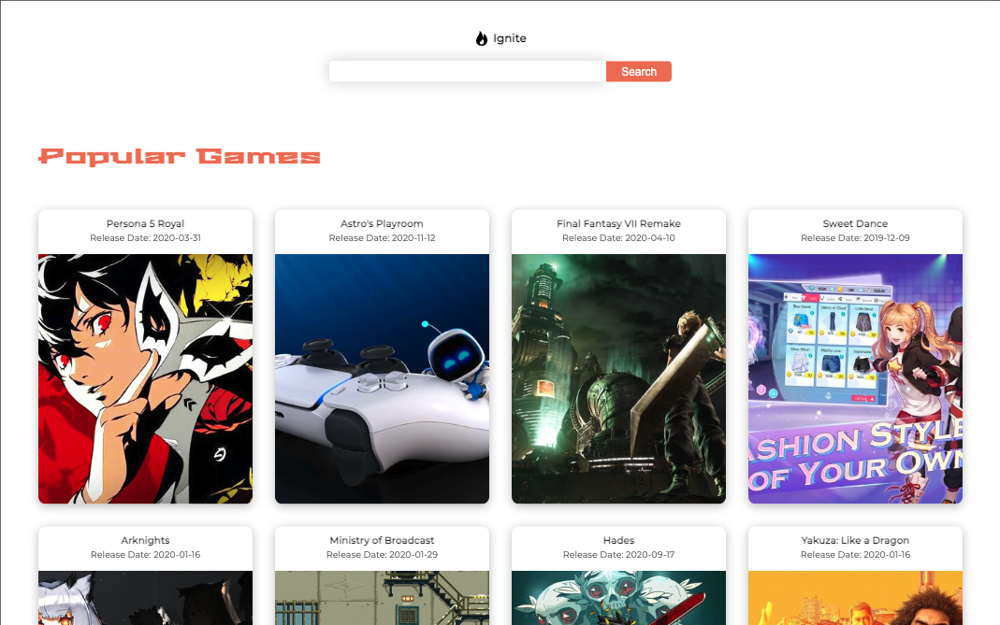
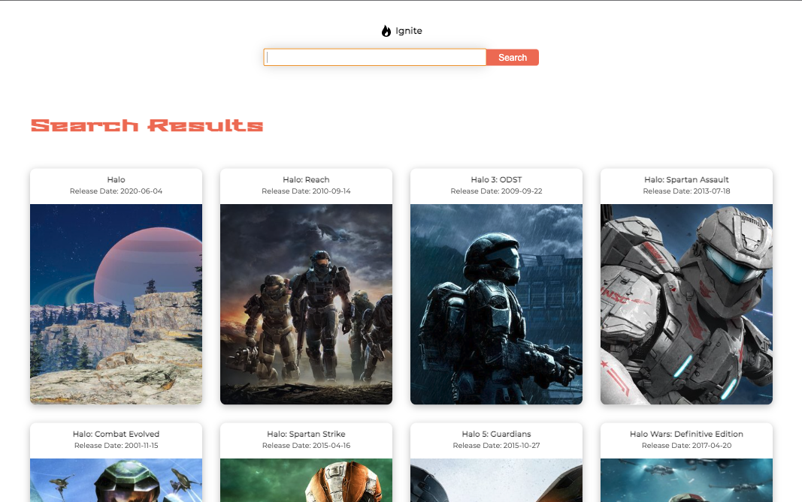
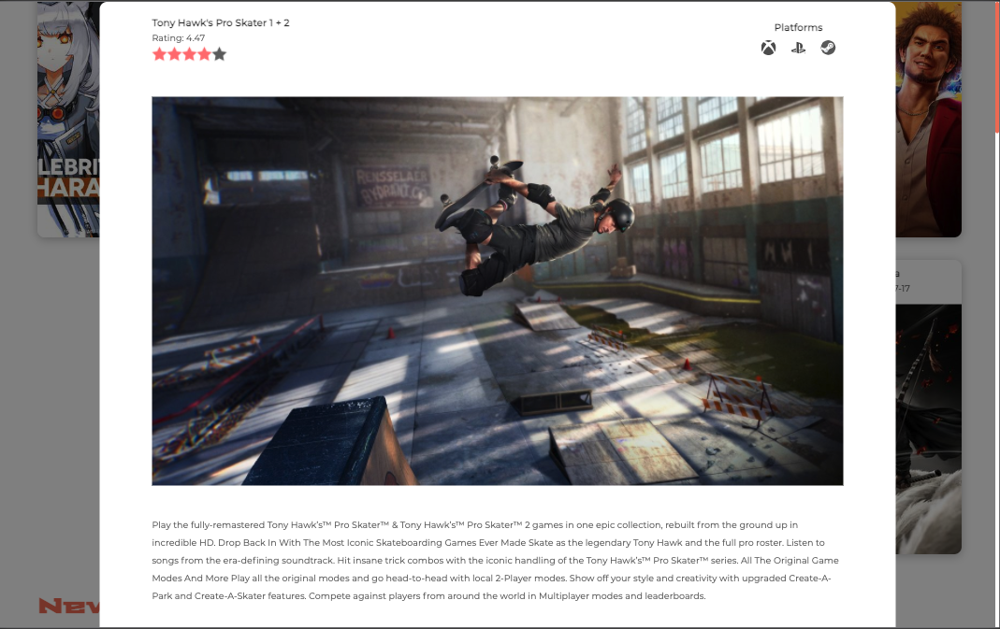

# "Ignite" Game info library

[Click here to launch.](https://spacial-fray-capture.netlify.app/)

This react website was built as an exercise in [@developedbyed](https://github.com/developedbyed)'s React course. The app uses data from the [RAWG.io](https://rawg.io/apidocs) API to display information about popular, new, and upcoming video games across all gaming platforms. You can also search for a game.

## Screenshots

Home page with no search:

After searching "Halo":

Click on any game to expand a card with further information.

# License

